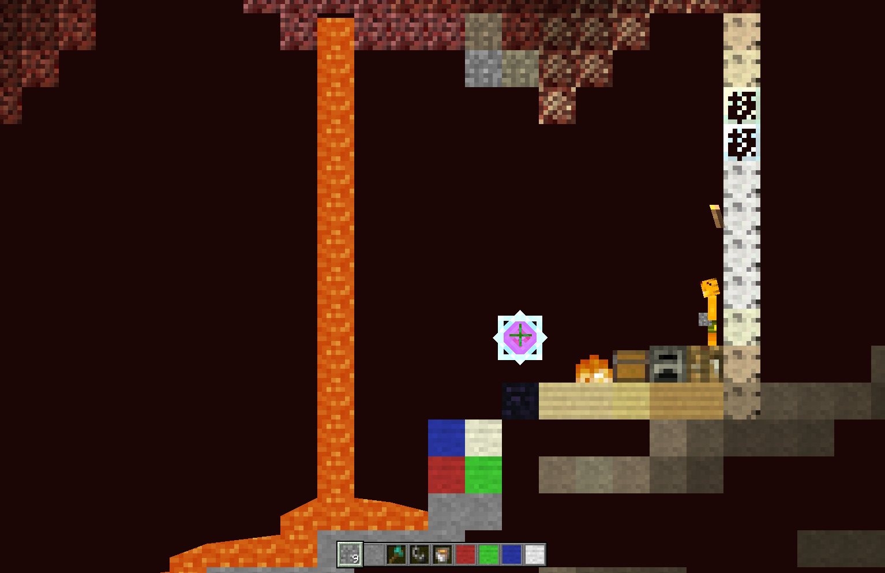

# 8x8 texture pack

This pack is simply a 2x downscale of the default textures and is not meant to be "high-effort" in any way. It is purely for demonstrational purposes.

To apply this texture pack, add this line to your resource maps:
```
vanilla https://raw.githubusercontent.com/open-mc/component-api/refs/heads/main/examples/8x8/map.txt
```
This can be made server-wide in the server's properties.yaml or game-wide in your game's **Client mods** menu